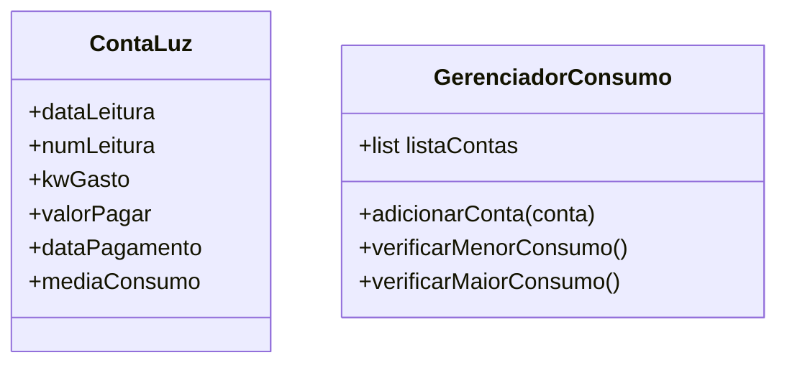
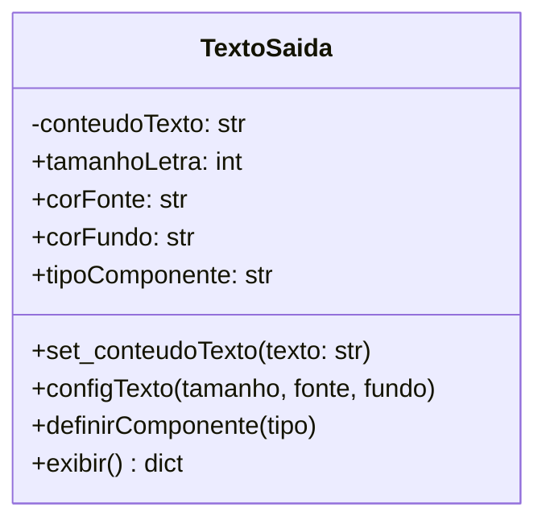

# 📋 Documentação de Requisitos - APS (Lista 01)

Este documento detalha os Requisitos Funcionais (RF) e Não Funcionais (RNF) para cada um dos problemas analisados no projeto.

---

## ⚡ 01. Sistema de Gestão: Conta de Luz

### 1.1 Requisitos Funcionais (RF)
* **RF01 - Cadastro de Medição:** O sistema deve permitir a entrada detalhada dos dados de consumo de energia, incluindo a data da leitura (dia/mês/ano), o número sequencial registrado no relógio de luz, a quantidade de quilowatts (kW) consumidos no período, o valor total da fatura em moeda corrente (R$), a data em que o pagamento foi efetuado e a média histórica de consumo.
* **RF02 - Listagem de Histórico:** O sistema deve apresentar todos os registros armazenados em uma estrutura de tabela clara e organizada, permitindo a visualização cronológica dos gastos de luz.
* **RF03 - Análise de Eficiência (Menor Consumo):** O sistema deve processar a base de dados para identificar e destacar automaticamente o registro que possui o menor valor de kW gasto, informando ao usuário o mês correspondente.
* **RF04 - Análise de Pico (Maior Consumo):** O sistema deve processar a base de dados para identificar e destacar automaticamente o registro com o maior valor de kW gasto para fins de acompanhamento de picos de consumo.

### 1.2 Requisitos Não Funcionais (RNF)
* **RNF01 - Interface Web:** A aplicação deve ser desenvolvida utilizando o framework **Streamlit**, garantindo uma interface responsiva e intuitiva.
* **RNF02 - Linguagem e Estrutura:** O desenvolvimento deve utilizar **Python 3.x** seguindo os princípios de Orientação a Objetos (OO).
* **RNF03 - Validação de Integridade:** O sistema não deve permitir a entrada de valores negativos para campos de consumo (kW) e valores monetários (R$).
* **RNF04 - Cibersegurança (Sanitização de Dados):** O sistema deve tratar todas as entradas do usuário para prevenir ataques de *Injection*. Os dados devem ser tipados rigorosamente (ex: `float`, `int`) para evitar execução de scripts maliciosos.
* **RNF05 - Cibersegurança (Privacidade):** O sistema deve garantir que os dados de consumo sejam armazenados apenas em memória de sessão segura (`st.session_state`), evitando exposição em logs ou URLs.

---
### Diagrama de Classe - Questão 01

---

## 🖥️ 02. Exercício: Classe TextoSaída

### 2.1 Requisitos Funcionais (RF)
* **RF01 - Definição de Conteúdo:** O sistema deve permitir que o usuário insira um texto (conteúdo) que será processado pela classe.
* **RF02 - Configuração Estética:** O sistema deve permitir configurar o tamanho da letra, a cor da fonte e a cor de fundo do texto.
* **RF03 - Seleção de Componente:** O sistema deve permitir a escolha do tipo de componente visual para exibição, restrito às opções: **Label** (rótulo estático), **Edit** (campo de linha única) e **Memo** (área de texto multilinha).
* **RF04 - Restrição de Cores:** O sistema deve limitar as cores de fonte e fundo exclusivamente aos tons: preto, branco, azul, amarelo ou cinza.
* **RF05 - Renderização Visual:** O sistema deve aplicar as configurações em tempo real e exibir o resultado visual simulando o componente escolhido.

### 2.2 Requisitos Não Funcionais (RNF)
* **RNF01 - Independência Visual:** A classe de domínio (`TextoSaida`) deve ser pura, ou seja, não deve herdar classes visuais de frameworks específicos, garantindo portabilidade.
* **RNF02 - Padronização com Enums:** Devem ser utilizados tipos enumerados (Enums) para garantir que apenas cores e componentes válidos sejam processados (Cibersegurança/Integridade).
* **RNF03 - Interface Web:** O front-end deve ser implementado via **Streamlit** com uso de injeção de CSS controlado para simular as propriedades visuais.
* **RNF04 - Cibersegurança (XSS Prevention):** O sistema deve tratar a exibição de HTML para garantir que apenas o estilo pretendido seja renderizado, sem execução de scripts externos.

---
### Diagrama de Classe - Questão 02

