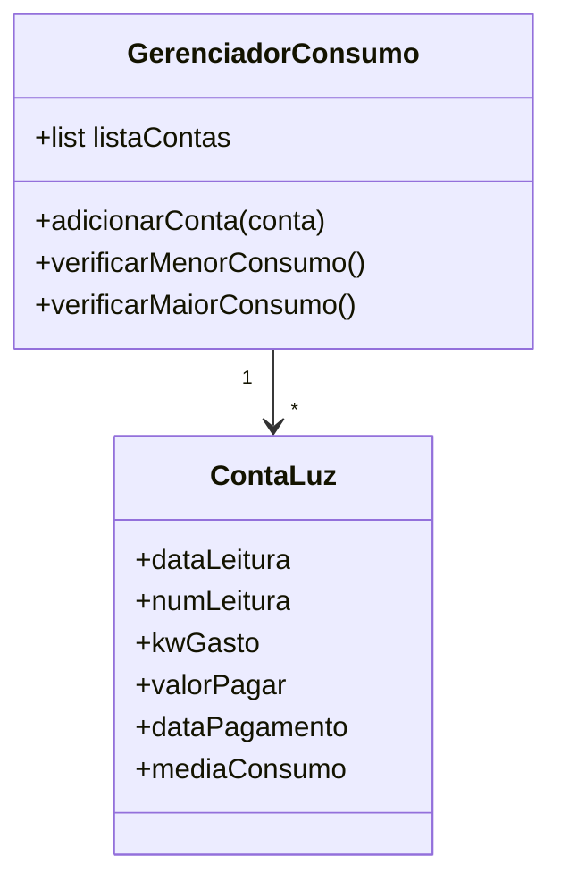
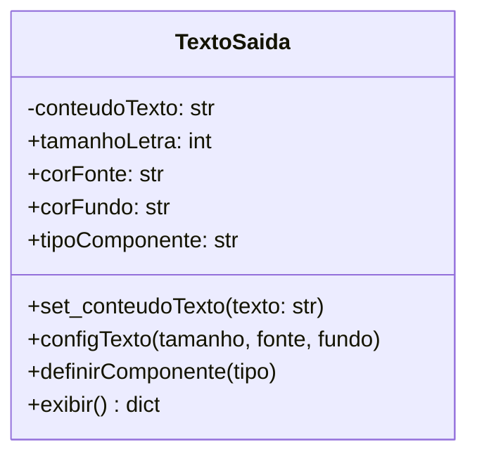
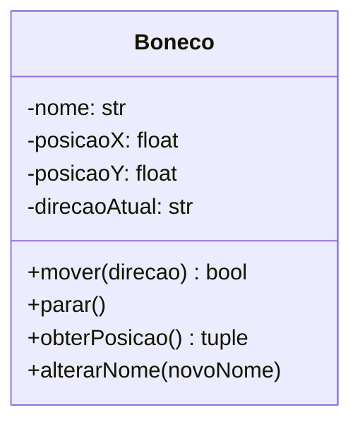
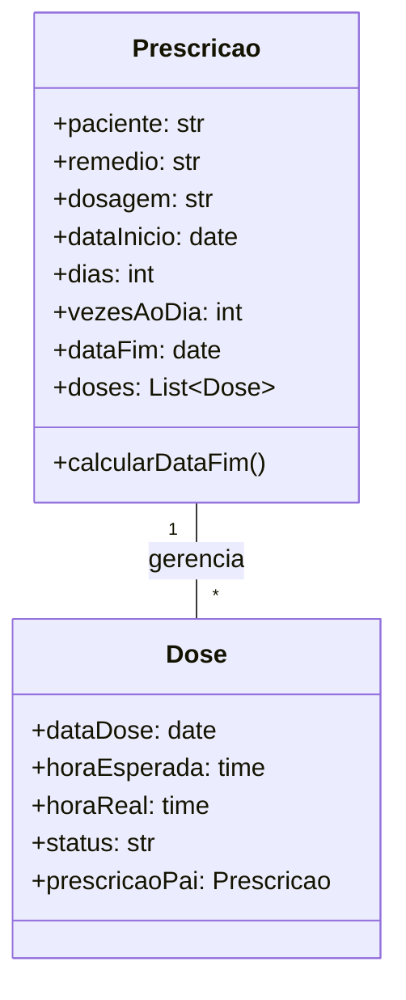
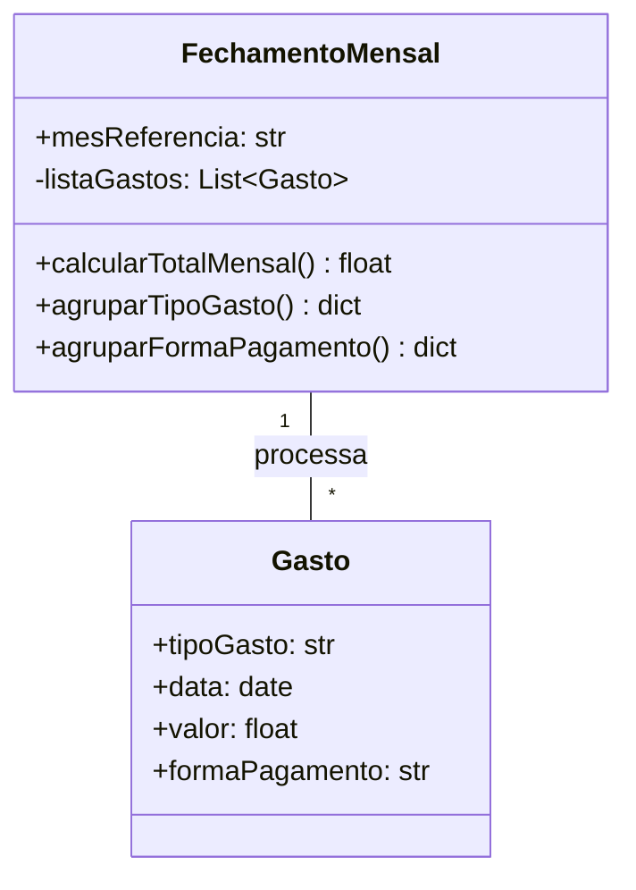
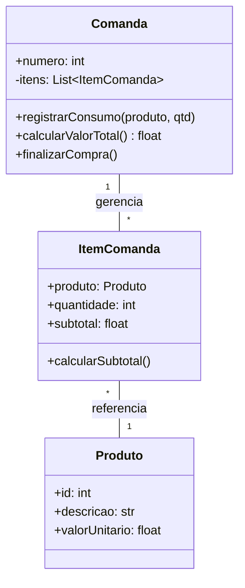
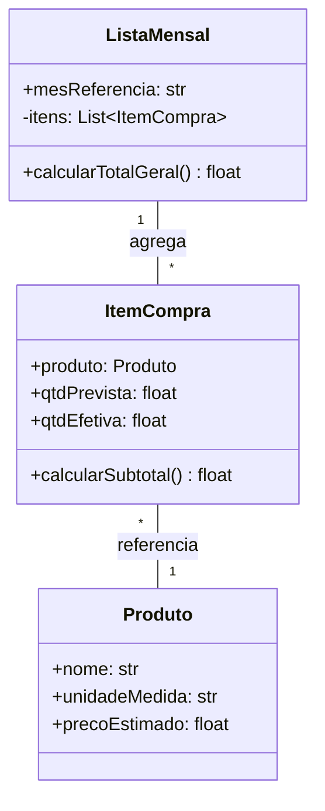
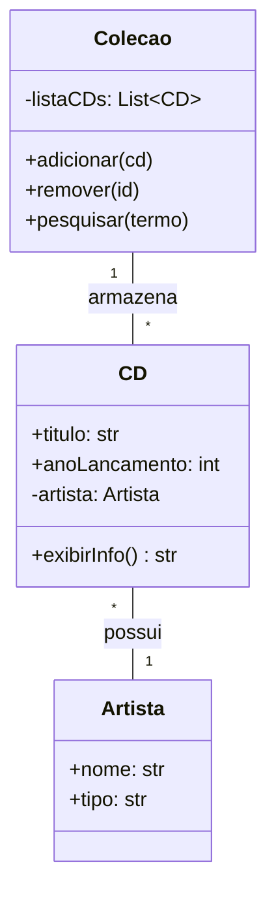

# 📋 Documentação de Requisitos - APS (Lista 01)

Este documento detalha os Requisitos Funcionais (RF) e Não Funcionais (RNF) para cada um dos problemas analisados no projeto.

---

## ⚡ 01. Sistema de Gestão: Conta de Luz

### 1.1 Requisitos Funcionais (RF)
* **RF01 - Cadastro de Medição:** O sistema deve permitir a entrada detalhada dos dados de consumo de energia, incluindo a data da leitura (dia/mês/ano), o número sequencial registrado no relógio de luz, a quantidade de quilowatts (kW) consumidos no período, o valor total da fatura em moeda corrente (R$), a data em que o pagamento foi efetuado e a média histórica de consumo.
* **RF02 - Listagem de Histórico:** O sistema deve apresentar todos os registros armazenados em uma estrutura de tabela clara e organizada, permitindo a visualização cronológica dos gastos de luz.
* **RF03 - Análise de Eficiência (Menor Consumo):** O sistema deve processar a base de dados para identificar e destacar automaticamente o registro que possui o menor valor de kW gasto, informando ao usuário o mês correspondente.
* **RF04 - Análise de Pico (Maior Consumo):** O sistema deve processar a base de dados para identificar e destacar automaticamente o registro com o maior valor de kW gasto para fins de acompanhamento de picos de consumo.

### 1.2 Requisitos Não Funcionais (RNF)
* **RNF01 - Interface Web:** A aplicação deve ser desenvolvida utilizando o framework **Streamlit**, garantindo uma interface responsiva e intuitiva.
* **RNF02 - Linguagem e Estrutura:** O desenvolvimento deve utilizar **Python 3.x** seguindo os princípios de Orientação a Objetos (OO).
* **RNF03 - Validação de Integridade:** O sistema não deve permitir a entrada de valores negativos para campos de consumo (kW) e valores monetários (R$).
* **RNF04 - Cibersegurança (Sanitização de Dados):** O sistema deve tratar todas as entradas do usuário para prevenir ataques de *Injection*. Os dados devem ser tipados rigorosamente (ex: `float`, `int`) para evitar execução de scripts maliciosos.
* **RNF05 - Cibersegurança (Privacidade):** O sistema deve garantir que os dados de consumo sejam armazenados apenas em memória de sessão segura (`st.session_state`), evitando exposição em logs ou URLs.

---
### Diagrama de Classe - Questão 01

---

## 🖥️ 02. Exercício: Classe TextoSaída

### 2.1 Requisitos Funcionais (RF)
* **RF01 - Definição de Conteúdo:** O sistema deve permitir que o usuário insira um texto (conteúdo) que será processado pela classe.
* **RF02 - Configuração Estética:** O sistema deve permitir configurar o tamanho da letra, a cor da fonte e a cor de fundo do texto.
* **RF03 - Seleção de Componente:** O sistema deve permitir a escolha do tipo de componente visual para exibição, restrito às opções: **Label** (rótulo estático), **Edit** (campo de linha única) e **Memo** (área de texto multilinha).
* **RF04 - Restrição de Cores:** O sistema deve limitar as cores de fonte e fundo exclusivamente aos tons: preto, branco, azul, amarelo ou cinza.
* **RF05 - Renderização Visual:** O sistema deve aplicar as configurações em tempo real e exibir o resultado visual simulando o componente escolhido.

### 2.2 Requisitos Não Funcionais (RNF)
* **RNF01 - Independência Visual:** A classe de domínio (`TextoSaida`) deve ser pura, ou seja, não deve herdar classes visuais de frameworks específicos, garantindo portabilidade.
* **RNF02 - Padronização com Enums:** Devem ser utilizados tipos enumerados (Enums) para garantir que apenas cores e componentes válidos sejam processados (Cibersegurança/Integridade).
* **RNF03 - Interface Web:** O front-end deve ser implementado via **Streamlit** com uso de injeção de CSS controlado para simular as propriedades visuais.
* **RNF04 - Cibersegurança (XSS Prevention):** O sistema deve tratar a exibição de HTML para garantir que apenas o estilo pretendido seja renderizado, sem execução de scripts externos.

---
### Diagrama de Classe - Questão 02

---

## 🕹️ 03. Exercício: Classe Boneco em Movimento

### 3.1 Requisitos Funcionais (RF)
* **RF01 - Identificação do Personagem:** O sistema deve permitir atribuir e alterar o nome do boneco.
* **RF02 - Controle de Movimentação:** O sistema deve permitir mover o boneco em quatro direções: Cima, Baixo, Direita e Esquerda.
* **RF03 - Gestão de Coordenadas:** O sistema deve manter e atualizar as coordenadas cartesianas (X e Y) do boneco a cada movimento realizado.
* **RF04 - Monitoramento de Direção:** O sistema deve registrar a última direção tomada ou indicar se o boneco está parado.
* **RF05 - Relatório de Status:** O sistema deve exibir em tempo real a posição atual (X, Y) e o nome do boneco na interface.

### 3.2 Requisitos Não Funcionais (RNF)
* **RNF01 - Restrição de Fronteira:** O sistema deve impedir que o boneco ultrapasse os limites definidos da tela (Grid de 0 a 10), garantindo a integridade do cenário.
* **RNF02 - Encapsulamento Rigoroso:** Os atributos de posição e direção devem ser privados (`_`), sendo acessados apenas por métodos específicos (Cibersegurança/Arquitetura).
* **RNF03 - Interface Gráfica:** A visualização deve ser feita via **Plotly** integrado ao **Streamlit**, permitindo uma representação visual clara do movimento no plano cartesiano.
* **RNF04 - Cibersegurança (Validação de Entrada):** O sistema deve validar o nome do boneco para evitar entradas de scripts maliciosos em campos de texto.

---
### Diagrama de Classe - Questão 03

---

## 💊 04. Exercício: Horário de Remédios

### 4.1 Requisitos Funcionais (RF)
* **RF01 - Cadastro de Prescrição:** O sistema deve permitir o cadastro do paciente, nome do remédio, dosagem, data de início, duração do tratamento (dias) e frequência diária.
* **RF02 - Sugestão de Horários:** Ao definir a frequência, o sistema deve sugerir automaticamente os intervalos de horários para as doses.
* **RF03 - Personalização de Cronograma:** O usuário deve poder escolher o horário da primeira dose, e o sistema deve calcular os demais horários com base nisso.
* **RF04 - Cálculo de Término:** O sistema deve informar automaticamente a data final do tratamento.
* **RF05 - Geração de Planilha:** O sistema deve gerar uma grade completa de horários para todo o período do tratamento.
* **RF06 - Agenda Diária:** O sistema deve filtrar e exibir apenas os remédios programados para o dia atual.
* **RF07 - Registro de Dose:** O usuário deve marcar quando tomou o remédio. O sistema deve registrar o horário real.
* **RF08 - Reorganização por Atraso:** Caso uma dose seja tomada com atraso, o sistema deve recalcular automaticamente os horários das doses restantes **apenas para aquele dia**.

### 4.2 Requisitos Não Funcionais (RNF)
* **RNF01 - Persistência de Dados:** Uso de **SQLite** para garantir que os dados não sejam perdidos ao fechar o navegador (Diferencial Sênior).
* **RNF02 - Notificação Simulada:** O sistema deve destacar visualmente doses pendentes e atrasadas na interface.
* **RNF03 - Cibersegurança (SQL Injection):** Uso de *Parameterized Queries* para todas as interações com o banco de dados.
* **RNF04 - Integridade Temporal:** O sistema não deve permitir cadastros de tratamentos com datas retroativas.

---
### Diagrama de Classe - Questão 04

---

## 💸 05. Exercício: Gastos Diários (Vera)

### 5.1 Requisitos Funcionais (RF)
* **RF01 - Registro de Despesas:** O sistema deve permitir o cadastro de gastos informando: tipo (categoria), data, valor e forma de pagamento.
* **RF02 - Categorização de Gastos:** O sistema deve oferecer categorias pré-definidas (remédio, roupa, refeição, etc.).
* **RF03 - Gestão de Pagamentos:** O sistema deve suportar múltiplas formas de pagamento: dinheiro, crédito, débito, Ticket Alimentação e Ticket Refeição.
* **RF04 - Fechamento Mensal:** O sistema deve permitir filtrar os gastos por mês para consolidação de dados.
* **RF05 - Agrupamento por Categoria:** O sistema deve calcular o total gasto em cada tipo de despesa no mês selecionado.
* **RF06 - Agrupamento por Forma de Pagamento:** O sistema deve detalhar o quanto foi gasto em cada modalidade de pagamento dentro de cada categoria.

### 5.2 Requisitos Não Funcionais (RNF)
* **RNF01 - Usabilidade (Planilha):** A interface deve permitir a edição rápida em formato de grade (grid), similar ao Excel.
* **RNF02 - Formatação Monetária:** Todos os valores devem ser exibidos no padrão brasileiro (R$).
* **RNF03 - Cibersegurança (Validação de Tipos):** O sistema deve impedir a entrada de textos em campos numéricos de valor para evitar erros de processamento.
* **RNF04 - Portabilidade:** O sistema deve permitir a exportação dos dados consolidados para o formato CSV.

---
### Diagrama de Classe - Questão 05

---

## 🥐 06. Exercício: Comanda Eletrônica (Padaria Doce Sabor)

### 6.1 Requisitos Funcionais (RF)
* **RF01 - Cadastro de Produtos:** O sistema deve manter um catálogo de produtos com descrição e valor unitário.
* **RF02 - Identificação de Comanda:** O sistema deve permitir a abertura de uma comanda por meio de uma numeração única.
* **RF03 - Registro de Consumo:** O atendente deve poder lançar produtos e quantidades em uma comanda específica.
* **RF04 - Leitura de Comanda:** No caixa, o sistema deve recuperar todos os itens lançados em uma comanda informada.
* **RF05 - Cálculo de Subtotal:** O sistema deve calcular automaticamente o valor de cada item (quantidade x valor unitário).
* **RF06 - Cálculo de Total Geral:** O sistema deve somar todos os subtotais da comanda para apresentar o valor final da compra.
* **RF07 - Finalização de Venda:** O sistema deve permitir o fechamento da comanda, limpando seus itens e liberando o número para um novo cliente.

### 6.2 Requisitos Não Funcionais (RNF)
* **RNF01 - Persistência em Banco de Dados:** Uso de **SQLite** para garantir que os dados lançados pelo atendente fiquem disponíveis imediatamente para o caixa.
* **RNF02 - Integridade de Dados:** O sistema deve garantir que o valor unitário utilizado no cálculo seja o valor vigente no momento da leitura da comanda.
* **RNF03 - Cibersegurança (Controle de Acesso):** Simulação de proteção por senha para operações sensíveis, como cancelamento de itens (Área do Gerente).
* **RNF04 - Usabilidade (Módulos):** A interface deve ser dividida em módulos distintos para Atendente e Caixa, simulando o fluxo real de uma padaria.

---
### Diagrama de Classe - Questão 06

---

## 🛒 07. Exercício: Lista de Compras (Carolina)

### 7.1 Requisitos Funcionais (RF)
* **RF01 - Gerenciar Catálogo:** Permite cadastrar o nome do produto e sua unidade de medida (Kg, Unidade, Litro, Caixa).
* **RF02 - Planejamento Mensal:** Permite definir a "Quantidade Mês" (estimativa de consumo) e a "Quantidade Compra" (o que será de fato adquirido no período).
* **RF03 - Gestão de Preços:** Permite a atualização do preço estimado de cada produto com base na última análise de mercado realizada pela usuária.
* **RF04 - Cálculo Dinâmico:** O sistema deve calcular o subtotal por item (Qtd. Compra × Preço Estimado) e o somatório total da lista em tempo real.
* **RF05 - Persistência Histórica:** Possibilidade de salvar listas de meses diferentes para comparação.

### 7.2 Requisitos Não Funcionais (RNF)
* **RNF01 - Confiabilidade:** Validação rigorosa de tipos de dados; campos de quantidade e preço não devem aceitar valores negativos ou nulos.
* **RNF02 - Eficiência de Interface:** Uso de interface tipo "Data Editor" para minimizar a quantidade de cliques no preenchimento da lista.
* **RNF03 - Portabilidade:** Execução via navegador através do framework **Streamlit**.
* **RNF04 - Cibersegurança:** Proteção contra entradas maliciosas via sanitização de inputs de texto (Regex básico).

---
### Diagrama de Classe - Questão 07

---

## 💿 08. Exercício: Coleção de CDs (Adriano)

### 8.1 Requisitos Funcionais (RF)
* **RF01 - Cadastro de Acervo:** O sistema deve permitir o registro de CDs informando o título do álbum, o nome do artista (cantor ou conjunto) e o ano de lançamento.
* **RF02 - Manutenção de Dados:** O sistema deve permitir a edição e a exclusão de CDs cadastrados para manter a coleção atualizada.
* **RF03 - Organização Alfabética:** A listagem dos CDs deve ser exibida automaticamente em ordem alfabética pelo título para facilitar a localização.
* **RF04 - Busca Rápida:** O sistema deve oferecer um campo de pesquisa que filtre os CDs por título ou nome do artista em tempo real.
* **RF05 - Categorização de Artista:** O sistema deve permitir distinguir se o artista é um "Cantor Solo" ou um "Conjunto/Banda".

### 8.2 Requisitos Não Funcionais (RNF)
* **RNF01 - Usabilidade Mobile (Palm-top):** A interface deve ser responsiva e utilizar elementos visuais (cards e botões largos) que facilitem o toque em telas pequenas.
* **RNF02 - Persistência Confiável:** Uso de **SQLite** para garantir que a coleção seja preservada permanentemente.
* **RNF03 - Eficiência de Busca:** As consultas ao banco de dados devem utilizar indexação para garantir que a filtragem de grandes coleções seja instantânea.
* **RNF04 - Cibersegurança (Integridade):** O sistema deve validar o campo "Ano" para aceitar apenas valores numéricos dentro de um intervalo histórico válido (ex: 1900 a 2030).

---
### Diagrama de Classe - Questão 08

